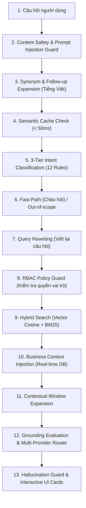

# CẨM NANG TOÀN DIỆN ÔN TẬP & BẢO VỆ ĐỒ ÁN CAPSTONE / SWP391
## DÀNH RIÊNG CHO: HOÀNG MINH ĐỨC (DucHM — HE187354 / `mduc1011-swp`)
**Dự án**: Tutor Connect System (TCS) — Hệ thống kết nối Gia sư thông minh  
**Khung giờ bảo vệ chính thức**: **10:50 – 12:20, Thứ Bảy ngày 26/09/2026**  
**Mục tiêu**: Làm chủ 100% luồng code, giải thích tường minh từ UI đến CSDL, tự tin bảo vệ xuất sắc trước hội đồng.

---

# MỤC LỤC
1. [PHẦN 1: BẢNG MA TRẬN TRA CỨU NHANH 1 GIÂY (CHEAT SHEET MATRIX)](#phần-1-bảng-ma-trận-tra-cứu-nhanh-1-giây-cheat-sheet-matrix)
2. [PHẦN 2: GIẢI PHẪU CHI TIẾT TỪNG LUỒNG CODE THỰC CHIẾN](#phần-2-giải-phẫu-chi-tiết-từng-luồng-code-thực-chiến)
   - [CHƯƠNG 1: PHÂN HỆ HỖ TRỢ KHÁCH HÀNG (BF-09)](#chương-1-phân-hệ-hỗ-trợ-khách-hàng-bf-09)
   - [CHƯƠNG 2: PHÂN HỆ ĐIỀU HÀNH SÀN & BẢO MẬT (BF-10)](#chương-2-phân-hệ-điều-hành-sàn--bảo-mật-bf-10)
   - [CHƯƠNG 3: TRỢ LÝ ẢO AI UNIVERSAL RAG 12 BƯỚC (UC-65)](#chương-3-trợ-lý-ảo-ai-universal-rag-12-bước-uc-65)
   - [CHƯƠNG 4: HỢP ĐỒNG ĐIỆN TỬ KÝ SỐ OTP & HỒ SƠ ĐA VAI TRÒ (UC-44 & M4)](#chương-4-hợp-đồng-điện-tử-ký-số-otp--hồ-sơ-đa-vai-trò-uc-44--m4)
3. [PHẦN 3: KỊCH BẢN THUYẾT TRÌNH MẪU "5 BƯỚC CHỈ CODE"](#phần-3-kịch-bản-thuyết-trình-mẫu-5-bước-chỉ-code)
4. [PHẦN 4: BỘ CÂU HỎI PHẢN BIỆN "BẪY" CỦA HỘI ĐỒNG & CÂU TRẢ LỜI MẪU](#phần-4-bộ-câu-hỏi-phản-biện-bẫy-của-hội-đồng--câu-trả-lời-mẫu)

---

# PHẦN 1: BẢNG MA TRẬN TRA CỨU NHANH 1 GIÂY (CHEAT SHEET MATRIX)
*(Bảng này được thiết kế để mở sẵn trên một góc màn hình máy tính lúc bảo vệ. Thầy cô hỏi chức năng nào, bạn liếc mắt 1 giây là biết mở file nào dòng nào!)*

| STT | Tên Chức Năng / Use Case | File Giao Diện Frontend | Endpoint API | Backend Controller | Backend Service Implementation | Bảng CSDL Tác Động |
| :---: | :--- | :--- | :--- | :--- | :--- | :--- |
| **1** | **User gửi Ticket hỗ trợ** | `MessagingPanel.tsx` (L120) | `POST /api/messaging/tickets` | `MessagingController.java` (L110) | `MessagingServiceImpl.java` (L120) | `support_tickets`, `ticket_messages` |
| **2** | **Admin lọc & xem danh sách Ticket** | `PlatformTicketsPage.tsx` (L25) | `GET /api/platform/tickets` | `PlatformController.java` (L102) | `PlatformServiceImpl.java` (L1176) | `support_tickets` |
| **3** | **Admin mở Ticket (Auto-Assign PIC)** | `PlatformTicketsPage.tsx` (L63) | `GET /api/platform/tickets/{id}` | `PlatformController.java` (L334) | `PlatformServiceImpl.java` (L1201) | `support_tickets` (`assigned_admin_id`, `status='IN_PROGRESS'`) |
| **4** | **Admin phản hồi Ticket (First Response SLA)** | `PlatformTicketsPage.tsx` (L94) | `POST /api/platform/tickets/{id}/respond` | `PlatformController.java` (L346) | `PlatformServiceImpl.java` (L1278) | `ticket_messages`, `support_tickets` (`response_sla_ms`), `audit_logs` |
| **5** | **Đóng / Giải quyết Ticket** | `PlatformTicketsPage.tsx` (L99) | `POST /api/platform/tickets/{id}/close` | `PlatformController.java` (L353) | `PlatformServiceImpl.java` (L1322) | `support_tickets` (`resolved_at`, `closed_at`), `audit_logs` |
| **6** | **Gộp Ticket trùng lặp (Merge Ticket)** | `PlatformTicketsPage.tsx` (L103) | `POST /api/platform/tickets/{id}/merge` | `PlatformController.java` (L359) | `PlatformServiceImpl.java` (L1360) | `ticket_messages`, `support_tickets` (`status='CLOSED'`), `audit_logs` |
| **7** | **Quét & nâng cấp quá hạn SLA (Job/API)** | `useAdminTickets.tsx` (L45) | `POST /api/platform/tickets/scan-sla` | `PlatformController.java` (L365) | `PlatformServiceImpl.java` (L1433) | `support_tickets` (`priority`, `sla_breached=true`), `notifications` |
| **8** | **Chuyển Ticket sang Tranh chấp Escrow** | `PlatformTicketsPage.tsx` (L112) | `POST /api/platform/tickets/{id}/redirect-dispute` | `PlatformController.java` (L371) | `PlatformServiceImpl.java` (L1524) | `reports` (`target_type='CLASS'`), `support_tickets`, `audit_logs` |
| **9** | **Tra cứu FAQ & Hỗ trợ công khai** | `HelpPage.tsx` (L1) | `GET /api/catalog/faqs` | `CatalogController.java` (L25) | `CatalogServiceImpl.java` (L50) | `faq_entries`, `faq_categories` |
| **10** | **Quản trị kho tri thức FAQ (Admin CRUD)** | `PlatformFaqPage.tsx` (L1) | `/api/catalog/admin/faqs` | `CatalogController.java` (L80) | `CatalogServiceImpl.java` (L120) | `faq_entries` |
| **11** | **Admin Dashboard KPI & Sức khỏe sàn** | `PlatformDashboardPage.tsx` (L1) | `GET /api/platform/dashboard` | `PlatformController.java` (L158) | `PlatformServiceImpl.java` (L320) | `users`, `tutoring_classes`, `disputes`, `wallets` |
| **12** | **Quản lý User & Khóa Token JWT** | `PlatformUsersPage.tsx` (L1) | `PATCH /api/platform/users/{id}/status` | `PlatformController.java` (L135) | `PlatformServiceImpl.java` (L285) | `users` (`token_version`, `status`) |
| **13** | **Thẩm định danh tính eKYC CCCD / Bằng cấp** | `PlatformVerificationsPage.tsx` (L1) | `POST /api/platform/verifications/{id}/review` | `PlatformController.java` (L230) | `PlatformServiceImpl.java` (L650) | `verification_requests`, `verification_histories`, `tutors` |
| **14** | **Xử lý sự cố lớp học (7 phương án)** | `PlatformReportsPage.tsx` (L1) | `POST /api/platform/reports/{id}/resolve-issue` | `PlatformController.java` (L260) | `PlatformServiceImpl.java` (L850) | `reports`, `tutoring_classes`, `escrow_transactions` |
| **15** | **Xử phạt người dùng (User Penalties)** | `PlatformPenaltiesPage.tsx` (L1) | `POST /api/platform/penalties` | `PlatformPenaltyController.java` (L45) | `PenaltyServiceImpl.java` (L50) | `user_penalties`, `audit_logs` |
| **16** | **Chặn tính năng khi bị phạt** | Tích hợp liên module | `PenaltyAccessService.requireFeature()` | Filter / Interceptor | `PenaltyAccessServiceImpl.java` (L40) | `user_penalties` |
| **17** | **Phát hiện & cảnh báo Lách sàn** | `PlatformCircumventionPage.tsx` (L1) | `GET /api/platform/circumventions` | `CircumventionController.java` (L30) | `CircumventionServiceImpl.java` (L45) | `circumvention_detections` |
| **18** | **Giám sát Nhật ký Kiểm toán (Audit Logs)** | `PlatformAuditLogsPage.tsx` (L1) | `GET /api/platform/audit-logs` | `AuditLogController.java` (L30) | `AuditLogServiceImpl.java` (L40) | `audit_logs` |
| **19** | **Báo cáo Tài chính & Xuất CSV an toàn** | `PlatformAnalyticsPage.tsx` (L1) | `GET /api/platform/analytics/export-csv` | `PlatformAnalyticsController.java` (L80) | `PlatformAnalyticsServiceImpl.java` (L350) | `payment_transactions`, `escrow_transactions`, `wallets` |
| **20** | **Quản trị dòng tiền ký quỹ Escrow** | `PlatformEscrowPage.tsx` (L1) | `GET /api/platform/escrow` | `AdminEscrowController.java` (L30) | `AdminEscrowServiceImpl.java` (L50) | `escrow_transactions` |
| **21** | **Cấu hình biểu phí sàn & Phí đối tác** | `PlatformFeeSettingsPage.tsx` (L1) | `PUT /api/platform/centers/{id}/fee` | `PlatformController.java` (L420) | `PlatformServiceImpl.java` (L1050) | `tutor_centers` (`platform_fee_rate`) |
| **22** | **Quản lý Mẫu hợp đồng Master** | `PlatformContractTemplatesPage.tsx` (L1) | `POST /api/platform/contract-templates` | `PlatformController.java` (L480) | `PlatformServiceImpl.java` (L2100) | `contract_templates` |
| **23** | **Trợ lý Ảo AI Universal RAG 12 Bước** | `AiFloatingWidget.tsx`, `AiAssistantPage.tsx` | `POST /api/ai/chat` | `AiController.java` (L50) | `AiServiceImpl.java` (L118) | `ai_chat_sessions`, `ai_chat_messages`, `ai_knowledge_chunks` |
| **24** | **Hợp đồng điện tử Ký số OTP (UC-44)** | `ContractDetailPage.tsx` (L1) | `POST /api/contract/{id}/sign-otp` | `ContractController.java` (L80) | `ContractServiceImpl.java` (L350) | `contract_otps`, `contract_signatures`, `contracts` |
| **25** | **Đánh giá sao sau buổi học & Điểm uy tín** | `ContractDetailPage.tsx` (L150) | `POST /api/contract/reviews` | `ContractController.java` (L48) | `ReviewServiceImpl.java` (L59) | `reviews`, `class_assignments` |
| **26** | **Tách hồ sơ 3 vai trò (Client/Tutor/Center)** | `ClientProfilePage.tsx`, `TutorProfilePage.tsx` | `PUT /api/profile/client` | `ProfileController.java` (L45) | `ProfileServiceImpl.java` (L110) | `clients`, `tutors`, `tutor_centers` |
| **27** | **Quên mật khẩu OTP qua Email (DEF-62)** | `ForgotPasswordPage.tsx`, `ResetPasswordPage.tsx` | `POST /api/identity/reset-password` | `IdentityController.java` (L75) | `IdentityServiceImpl.java` (L230) | `password_reset_tokens`, `users` |

---

# PHẦN 2: GIẢI PHẪU CHI TIẾT TỪNG LUỒNG CODE THỰC CHIẾN

---

## CHƯƠNG 1: PHÂN HỆ HỖ TRỢ KHÁCH HÀNG (BF-09)

### 1.1. Luồng Người Dùng Tạo Ticket Khiếu Nại & Thuật Toán Ép Sàn Priority
* **Giao diện**: Người dùng đăng nhập (Client hoặc Tutor) truy cập trang hỗ trợ, mở form tại `frontend/src/features/messaging/components/MessagingPanel.tsx` (dòng 120-170).
* **Payload gửi lên**:
  ```json
  {
    "category": "DISPUTE",
    "subject": "Gia sư bùng buổi học thứ 3 không lý do",
    "description": "Tôi đã thanh toán giữ tiền escrow nhưng gia sư không vào lớp...",
    "priority": "LOW",
    "targetClassId": 45
  }
  ```
* **Controller**: `MessagingController.java` nhận tại `@PostMapping("/tickets")` (dòng 110).
* **Logic Service (`MessagingServiceImpl.java` dòng 120-157)**:
  1. **Lấy User**: `User user = authHelper.currentUserOrThrow();`
  2. **Thuật toán ép sàn mức ưu tiên (`escalatePriority` - dòng 180-187)**:
     ```java
     SupportTicketPriority floor = CATEGORY_MIN_PRIORITY.getOrDefault(category, SupportTicketPriority.LOW);
     return requestedPriority.ordinal() > floor.ordinal() ? requestedPriority : floor;
     ```
     * Bảng sàn định nghĩa tại dòng 68-72: `DISPUTE` -> ép lên `URGENT`; `SYSTEM_ERROR`/`REPORT_USER` -> ép lên `HIGH`; `BUG_REPORT` -> ép lên `MEDIUM`. Dù người dùng có chọn `LOW` thì hệ thống vẫn tự động ép lên `URGENT`!
  3. **Tính hạn chót cam kết SLA (`dueAt` - dòng 136 & 190-200)**:
     * `URGENT`: `now + 4 giờ`
     * `HIGH`: `now + 12 giờ`
     * `MEDIUM`: `now + 24 giờ`
     * `LOW`: `now + 48 giờ`
  4. **Lưu CSDL & Khởi tạo tin nhắn đầu tiên (dòng 147 & 203-211)**:
     * `supportTicketRepository.save(ticket)` -> sinh khóa chính `ticket_id`, trạng thái mặc định `OPEN`.
     * Tạo 1 bản ghi `TicketMessage`: `isFromAdmin = false`, nội dung lấy từ `description`, lưu vào bảng `ticket_messages`.
  5. **Bắn thông báo Admin (dòng 214-234)**:
     Gửi Notification thời gian thực cho tất cả Admin đang `ACTIVE` với template `SUPPORT_TICKET_CREATED`.

---

### 1.2. Luồng Admin Tiếp Nhận & Thuật Toán Tự Động Gán PIC (Auto-Assignment)
* **Giao diện**: Quản trị viên mở bảng điều khiển `PlatformTicketsPage.tsx` (dòng 62-63). Bấm vào xem 1 ticket đang `OPEN`.
* **API**: `GET /api/platform/tickets/{ticketId}` -> `PlatformController.java` (dòng 334).
* **Logic Service (`PlatformServiceImpl.java` dòng 1200-1212)**:
  ```java
  SupportTicket ticket = findTicketOrThrow(ticketId);
  if (ticket.getStatus() == SupportTicketStatus.OPEN) {
      PlatformAdmin admin = currentAdminOrThrow();
      ticket.setAssignedAdmin(admin);
      ticket.setStatus(SupportTicketStatus.IN_PROGRESS);
      ticket = supportTicketRepository.save(ticket);
  }
  return toTicketDetail(ticket);
  ```
* **Bản chất nghiệp vụ**: Ngăn ngừa tình trạng 2 admin cùng nhảy vào trả lời 1 khách hàng. Admin nào mở ticket đầu tiên, hệ thống lập tức chốt người đó làm Người chịu trách nhiệm chính (PIC) và chuyển trạng thái từ `OPEN` sang `IN_PROGRESS`.

---

### 1.3. Luồng Admin Phản Hồi & Đo Lường First Response SLA
* **Giao diện**: Admin nhập nội dung vào ô trả lời trên modal -> Bấm "Gửi phản hồi" (`handleRespond` - dòng 94 `PlatformTicketsPage.tsx`).
* **API**: `POST /api/platform/tickets/{ticketId}/respond` -> `PlatformController.java` (dòng 346).
* **Logic Service (`PlatformServiceImpl.java` dòng 1278-1318)**:
  1. Tạo thực thể `TicketMessage`: `isFromAdmin = true`, `sender = admin.getUser()`, `content = request.getContent()`, lưu vào bảng `ticket_messages`.
  2. Cập nhật trạng thái ticket: `ticket.setStatus(SupportTicketStatus.IN_REVIEW);`
  3. **Đo lường thời gian First Response SLA (dòng 1305-1307)**:
     ```java
     if (ticket.getResponseSlaMs() == null && ticket.getCreatedAt() != null) {
         ticket.setResponseSlaMs(Duration.between(ticket.getCreatedAt(), now).toMillis());
     }
     ```
     Tính bằng miligiây thời gian từ lúc khách tạo ticket đến lúc Admin có phản hồi đầu tiên.
  4. Kiểm tra vi phạm: `if (now.isAfter(dueAt)) ticket.setSlaBreached(true);`
  5. Ghi nhật ký kiểm toán: `auditLogService.record("RESPOND_TICKET", "SupportTicket", ticketId, null, request);`
  6. Bắn Notification cho khách: "Admin vừa phản hồi yêu cầu hỗ trợ của bạn".

---

### 1.4. Luồng Đóng / Giải Quyết Ticket
* **Giao diện**: Admin bấm nút "Giải quyết" (`RESOLVED`) hoặc "Đóng ticket" (`CLOSED`) (`handleClose` - dòng 99 `PlatformTicketsPage.tsx`).
* **API**: `POST /api/platform/tickets/{ticketId}/close` -> `PlatformController.java` (dòng 353).
* **Logic Service (`PlatformServiceImpl.java` dòng 1322-1351)**:
  1. Kiểm tra validation: Chỉ chấp nhận 2 trạng thái `RESOLVED` hoặc `CLOSED`.
  2. Ghi nhận mốc thời gian: Nếu `RESOLVED` -> gán `resolvedAt = now`. Nếu `CLOSED` -> gán `closedAt = now` (đồng thời nếu `resolvedAt` chưa có thì gán luôn bằng `now`).
  3. Ghi vết kiểm toán `CLOSE_TICKET` vào bảng `audit_logs`.
  4. Gửi thông báo hoàn tất về tài khoản người dùng.

---

### 1.5. 🌟 Thuật Toán Tự Động Quét & Thăng Cấp Quá Hạn SLA (Job-11)
* **Phương thức**: `scanAndEscalateSlaBreaches()`
* **Vị trí**: `PlatformServiceImpl.java` (dòng 1433 - 1510).
* **Cơ chế chạy**: Định kỳ (qua Scheduler hoặc Admin kích hoạt qua `POST /api/platform/tickets/scan-sla`).
* **Bóc tách 4 bước xử lý**:
  1. **Tìm kiếm các ticket vi phạm (dòng 1438)**:
     ```java
     List<SupportTicket> breachedCandidates = supportTicketRepository.findBreachedCandidateTickets(excludedStatuses, now);
     ```
     Điều kiện SQL: `status NOT IN ('RESOLVED', 'CLOSED') AND due_at < now AND sla_breached = false`.
  2. **Thăng cấp ưu tiên lũy tiến (`escalatePriority` - dòng 1512-1519)**:
     * `LOW` -> nâng lên `MEDIUM`
     * `MEDIUM` -> nâng lên `HIGH`
     * `HIGH` hoặc `URGENT` -> giữ ở `URGENT` (mức cao nhất).
  3. **Cập nhật dữ liệu & Ghi vết Audit Log (dòng 1452-1464)**:
     Gán `ticket.setSlaBreached(true)`, lưu CSDL, ghi log hành động `SLA_BREACH_ESCALATION` lưu lại `oldPriority` và `newPriority`.
  4. **Bắn thông báo kép (2 đầu) (dòng 1466-1506)**:
     * *Đầu Admin*: Gửi cảnh báo khẩn cấp cho Admin phụ trách (hoặc toàn bộ Admin nếu chưa gán): "Ticket #{id} đã quá hạn phản hồi, tự động nâng lên {newPriority}, yêu cầu xử lý gấp!".
     * *Đầu Khách hàng*: Bắn thông báo cập nhật tiến độ kèm lời xin lỗi vì sự chậm trễ.

---

### 1.6. 🌟 Thuật Toán Gộp Ticket Trùng Lặp (Merge Ticket)
* **Phương thức**: `mergeTicket(sourceTicketId, request)`
* **Vị trí**: `PlatformServiceImpl.java` (dòng 1360 - 1425).
* **Bài toán thực tế**: Một khách hàng nôn nóng gửi 3 ticket liên tiếp về cùng 1 sự cố nạp tiền.
* **Bóc tách 4 bước xử lý**:
  1. **Kiểm tra 4 điều kiện an toàn nghiêm ngặt (dòng 1365-1382)**:
     * `sourceTicketId != targetTicketId`: Không được tự gộp vào chính nó.
     * `sourceTicket.getUser().equals(targetTicket.getUser())`: Bắt buộc 2 ticket phải thuộc **cùng một người dùng** (chống gộp nhầm thông tin của người khác).
     * `sourceTicket.getStatus() != CLOSED` và `targetTicket.getStatus() != CLOSED`: Không cho phép gộp ticket đã đóng.
  2. **Di chuyển nội dung khiếu nại sang Ticket đích (dòng 1385-1398)**:
     Tạo 1 bản ghi `TicketMessage` mới trong Ticket đích với nội dung:
     ```
     [HỆ THỐNG - GỘP TICKET]
     Đã gộp nội dung từ Ticket #{sourceId} ({subject}):
     {description}

     Lý do gộp: {reason}
     ```
  3. **Đóng Ticket nguồn (dòng 1401-1408)**:
     Chuyển trạng thái Ticket nguồn sang `CLOSED`, gán `closedAt = now`.
  4. **Ghi Audit Log & Gửi thông báo (dòng 1415 & 1422)**:
     Ghi hành động `MERGE_TICKET` vào `audit_logs` và bắn thông báo cho người dùng biết yêu cầu của họ đã được gom về Ticket chính để xử lý tập trung.

---

### 1.7. 🌟 Chuyển Tiếp Sự Cố Sang Tranh Chấp Escrow (Redirect to Dispute)
* **Phương thức**: `redirectTicketToDispute(ticketId, request)`
* **Vị trí**: `PlatformServiceImpl.java` (dòng 1524 - 1585).
* **Bài toán thực tế**: Người dùng gửi ticket phàn nàn "Gia sư bùng buổi học". Đây là sự cố lớp học liên quan đến quyền lợi tài chính, không thể giải quyết bằng chat thông thường.
* **Luồng tích hợp liên phân hệ (Cross-module Integration)**:
  1. Lấy `targetClassId` từ request, kiểm tra sự tồn tại của lớp học trong `tutoringClassRepository`.
  2. Nâng Category của ticket sang `SupportTicketCategory.DISPUTE`.
  3. Ép mức ưu tiên lên tối thiểu là `HIGH`.
  4. Tạo tin nhắn hệ thống ghi nhận trong luồng trao đổi: `"[HỆ THỐNG - CHUYỂN TRANH CHẤP] Yêu cầu này đã được chuyển sang luồng Xử lý Tranh chấp..."`.
  5. **ĐIỂM ĂN ĐIỂM CỐT LÕI (dòng 1571-1580)**:
     Tự động tạo một bản ghi Báo cáo sự cố (`Report`):
     ```java
     Report report = new Report();
     report.setReporter(ticket.getUser());
     report.setTargetType(ReportTargetType.CLASS);
     report.setTargetId(tutoringClass.getClassId());
     report.setStatus(ReportStatus.PENDING);
     reportRepository.save(report);
     ```
     👉 *Báo cáo này ngay lập tức xuất hiện trên màn hình `/platform/reports` để Quản trị viên can thiệp tạm khóa giải ngân tiền ký quỹ Escrow của lớp học đó!*

---

## CHƯƠNG 2: PHÂN HỆ ĐIỀU HÀNH SÀN & BẢO MẬT (BF-10)

### 2.1. Admin Dashboard (UC-56)
* **Frontend**: [PlatformDashboardPage.tsx](file:///c:/Users/Admin/Documents/GitHub/Tutor-Connect-System-TCS-/frontend/src/features/platform/pages/PlatformDashboardPage.tsx) -> gọi `GET /api/platform/dashboard`.
* **Backend**: `PlatformServiceImpl.java` (dòng 320-450).
* **Nghiệp vụ**: Tổng hợp nhanh 4 khối dữ liệu:
  * Thẻ KPI vận hành: Tổng số người dùng hoạt động, Số lớp học đang mở, Số tranh chấp chờ xử lý, Số ticket vi phạm SLA.
  * Cảnh báo khẩn cấp: Yêu cầu rút tiền chưa duyệt, Báo cáo vi phạm chưa xử lý.
  * Biểu đồ tăng trưởng người dùng theo mốc thời gian.

### 2.2. Quản Trị User & Cơ Chế Vô Hiệu Hóa Token (JWT Invalidation)
* **Frontend**: [PlatformUsersPage.tsx](file:///c:/Users/Admin/Documents/GitHub/Tutor-Connect-System-TCS-/frontend/src/features/platform/pages/PlatformUsersPage.tsx).
* **Backend**: `PlatformController.java` (dòng 135) -> `PlatformServiceImpl.java` (dòng 285).
* **Điểm bảo mật ăn điểm**: Khi Admin đổi trạng thái tài khoản sang `BANNED` hoặc `SUSPENDED`:
  ```java
  user.setStatus(request.getStatus());
  user.setTokenVersion(user.getTokenVersion() + 1);
  userRepository.save(user);
  ```
  👉 *Trong `JwtFilter`, mỗi request gửi lên đều đối soát `tokenVersion` trong claim của token với CSDL. Khi `tokenVersion` tăng lên, toàn bộ token cũ lập tức bị từ chối truy cập (401 Unauthorized), buộc người dùng phải đăng xuất ngay lập tức.*

### 2.3. Quy Trình Thẩm Định eKYC CCCD / Bằng Cấp (UC-11)
* **Frontend**: [PlatformVerificationsPage.tsx](file:///c:/Users/Admin/Documents/GitHub/Tutor-Connect-System-TCS-/frontend/src/features/platform/pages/PlatformVerificationsPage.tsx).
* **Backend**: `PlatformServiceImpl.java` (dòng 650-750).
* **Luồng xử lý**:
  * Admin xem ảnh 2 mặt CCCD, bằng cấp chuyên môn đính kèm.
  * Nếu Duyệt (`VERIFIED`): Cập nhật trạng thái gia sư/trung tâm thành Đã xác minh (`isVerified = true`), cho phép nhận lớp dạy.
  * Nếu Từ chối (`REJECTED`): **Ràng buộc bắt buộc** `rejectNotes` tối thiểu 10 ký tự để giải thích rõ lý do cho người dùng (ảnh mờ, sai số định danh...) -> bắn thông báo kèm lý do về chuông thông báo.

### 2.4. Xử Phạt Người Dùng (Penalties) & Chặn Quyền Liên Module (UC-60)
* **Frontend**: [PlatformPenaltiesPage.tsx](file:///c:/Users/Admin/Documents/GitHub/Tutor-Connect-System-TCS-/frontend/src/features/platform/pages/PlatformPenaltiesPage.tsx).
* **Backend**: `PlatformPenaltyController.java` & `PenaltyServiceImpl.java`.
* **Cơ chế chặn quyền thực tế**:
  Trong `PenaltyAccessServiceImpl.java`, hệ thống cung cấp phương thức `requireFeatureNotBanned(userId, featureCode)`:
  * Khi người dùng vào đăng lớp (`CLASS_POSTING`), nộp đơn dạy (`TUTOR_APPLY`) hoặc gửi tin nhắn (`MESSAGING`), hệ thống sẽ gọi hàm này. Nếu tài khoản có bản ghi phạt còn hiệu lực (`expires_at > now`), hệ thống quăng ra ngoại lệ `ForbiddenException("Tài khoản của bạn đang bị tạm khóa tính năng này!")`.

### 2.5. Phát Hiện Lách Sàn (Circumvention Detection - UC-59)
* **Frontend**: [PlatformCircumventionPage.tsx](file:///c:/Users/Admin/Documents/GitHub/Tutor-Connect-System-TCS-/frontend/src/features/platform/pages/PlatformCircumventionPage.tsx).
* **Backend**: `CircumventionServiceImpl.java`.
* **Cơ chế quét**: Sử dụng Regular Expression (Regex) để tự động quét nội dung tin nhắn và bài đăng:
  * Nhận dạng số điện thoại (viết số liền: `0912345678`, viết cách: `0912 345 678`, hoặc viết bằng chữ: `không chín một hai...`).
  * Nhận dạng liên kết và tài khoản mạng xã hội ngoài sàn: `zalo.me`, `facebook.com`, `telegram`.
  * Khi phát hiện, tự động lưu vào bảng `circumvention_detections` để cảnh báo Admin xử phạt.

### 2.6. Phân Tích Dòng Tiền & Kỹ Thuật Xuất File CSV An Toàn (UC-41, UC-43)
* **Frontend**: [PlatformAnalyticsPage.tsx](file:///c:/Users/Admin/Documents/GitHub/Tutor-Connect-System-TCS-/frontend/src/features/platform/pages/PlatformAnalyticsPage.tsx).
* **Backend**: `PlatformAnalyticsServiceImpl.java` (dòng 350-450).
* **2 Kỹ thuật bảo mật xuất file CSV đạt điểm tối đa**:
  1. **Phòng chống lỗ hổng CSV Formula Injection (DDE)**:
     Nếu một ô dữ liệu (tên người dùng, mô tả) bắt đầu bằng các ký tự nguy hiểm: `=`, `+`, `-`, `@` (có thể bị Excel thực thi mã độc khi mở), backend sẽ tự động chèn thêm dấu nháy đơn `'` ở đầu chuỗi để Excel coi đó là văn bản thuần túy.
  2. **Chèn mã byte UTF-8 BOM (`\ufeff`)**:
     Chèn 3 byte BOM vào đầu luồng xuất tệp để Microsoft Excel tự động nhận diện bảng mã UTF-8 tiếng Việt, không bao giờ bị lỗi font hay vỡ ký tự có dấu.

---

## CHƯƠNG 3: TRỢ LÝ ẢO AI UNIVERSAL RAG 12 BƯỚC (UC-65)

Mở file: [backend/src/main/java/com/tcs/module/ai/service/impl/AiServiceImpl.java](file:///c:/Users/Admin/Documents/GitHub/Tutor-Connect-System-TCS-/backend/src/main/java/com/tcs/module/ai/service/impl/AiServiceImpl.java#L118-L350).



### Chi tiết 12 mắt xích cần thuộc lòng khi thuyết trình:
1. **Bước 0: Content Safety & Prompt Injection Guard**: Quét từ ngữ thô tục, bậy bạ và ngăn chặn các kỹ thuật lừa AI lộ dữ liệu riêng tư (Prompt Injection / Jailbreak).
2. **Bước 0.4: Synonym & Follow-up Expansion**: Chuẩn hóa từ lóng tiếng Việt, nhận diện đại từ thay thế trong câu tiếp nối ("ông ấy", "môn này").
3. **Bước 1: Semantic Cache Check**: Nếu câu hỏi tương tự câu đã từng hỏi trước đó với độ tương đồng Cosine Similarity >= 0.85, hệ thống trả lời ngay dưới 50ms mà không cần gọi API LLM tốn phí.
4. **Bước 2: 3-Tier Intent Classification**: Phân loại ý định 3 tầng (Domain -> SubIntent -> Trích xuất Entity như tên môn học, mức học phí, quận/huyện) qua 12 Intent Rules chuyên biệt.
5. **Bước 3: Fast-Path & Out-of-Scope Gating**: Trả lời ngay các câu chào hỏi, cảm ơn; từ chối khéo các câu hỏi không liên quan đến học tập kèm gợi ý dịch vụ sàn.
6. **Bước 4: Query Rewriting**: Viết lại câu hỏi ngắn cụt ngủn của người dùng thành câu đầy đủ nghĩa dựa vào lịch sử hội thoại gần nhất.
7. **Bước 5: RBAC Policy Guard**: Chỉ cung cấp thông tin phù hợp với quyền hạn của vai trò đang hỏi (GUEST, CLIENT, TUTOR, ADMIN).
8. **Bước 6: Hybrid Search (Vector + BM25)**: Tìm kiếm kết hợp vector embedding ngữ nghĩa (Cosine) và tìm kiếm từ khóa chính xác (BM25) trong bảng `ai_knowledge_chunks`.
9. **Bước 7: Business Context Injection (QUAN TRỌNG NHẤT)**: Truy vấn trực tiếp CSDL thời gian thực để tiêm dữ liệu thật vào System Prompt (Ví dụ: danh sách gia sư đang rảnh, lớp học đang mở, số dư ví hiện tại).
10. **Bước 8: Contextual Window Expansion**: Ghép nối các đoạn tri thức liền kề trước và sau chunk tìm được để đảm bảo tính mạch lạc của tài liệu.
11. **Bước 9: Grounding Evaluation & Multi-Provider Router**: Đánh giá độ tin cậy của thông tin truy xuất được, tự động định tuyến gọi mô hình (Gemini, Groq, Cerebras, DeepSeek) để tránh nghẽn hạn mức (rate limit).
12. **Bước 10: Hallucination Guard & Interactive Cards**: Quét đối chiếu câu trả lời cuối cùng để chống ảo giác (bịa đặt thông tin), đóng gói câu trả lời kèm theo các thẻ UI tương tác (Tutor Card, Class Card) để người dùng bấm vào xem trực tiếp.

---

## CHƯƠNG 4: HỢP ĐỒNG ĐIỆN TỬ KÝ SỐ OTP & HỒ SƠ ĐA VAI TRÒ (UC-44 & M4)

### 4.1. Vòng Đời Hợp Đồng Ký Số OTP Qua Email (UC-44)
* **Controller**: `ContractController.java` (dòng 80).
* **Service**: `ContractServiceImpl.java` (dòng 350-450).
* **Quy trình 4 bước ký số 2 lớp**:
  1. *Khởi tạo*: Tạo hợp đồng từ lớp học thỏa thuận thành công (trạng thái ban đầu `DRAFT`).
  2. *Gửi OTP ký số*: Hệ thống sinh ngẫu nhiên mã OTP 6 chữ số, băm bảo mật lưu vào bảng `contract_otps` với thời hạn hiệu lực **5 phút**, gửi email bảo mật tới hộp thư của bên ký.
  3. *Ký xác thực*: Người dùng nhập OTP trên giao diện -> Backend kiểm tra trùng khớp -> Tạo bản ghi chữ ký điện tử trong `contract_signatures` kèm địa chỉ IP và dấu thời gian.
  4. *Kích hoạt*: Khi **cả 2 bên** (Phụ huynh và Gia sư) đều đã ký đủ -> Trạng thái hợp đồng chuyển thành `ACTIVE` -> Hệ thống kích hoạt trạng thái giữ tiền ký quỹ Escrow.

### 4.2. Đánh Giá Sao & Tính Lại Điểm Uy Tín Sau Buổi Học
* **Service**: `ReviewServiceImpl.java` (dòng 59-120).
* **Ràng buộc nghiệp vụ**:
  * Chỉ người thực sự tham gia lớp học (Client thuê hoặc Gia sư đứng lớp) mới có quyền đánh giá.
  * Mỗi phân công lớp học (`ClassAssignment`) chỉ được gửi đánh giá đúng **1 lần duy nhất**.
  * Sau khi lưu đánh giá vào bảng `reviews`, hệ thống kích hoạt tính toán lại Điểm uy tín trung bình (Reputation Score) của gia sư dựa trên điểm số sao và số lượng đánh giá tích lũy.

### 4.3. Phân Tách Hồ Sơ 3 Vai Trò Riêng Biệt (DEF-UI)
* Thay vì gộp chung một trang hồ sơ gây nhầm lẫn trường dữ liệu, hệ thống đã tách thành 3 trang chuyên biệt:
  * [ClientProfilePage.tsx](file:///c:/Users/Admin/Documents/GitHub/Tutor-Connect-System-TCS-/frontend/src/features/profile/pages/ClientProfilePage.tsx): Quản lý thông tin phụ huynh và danh sách hồ sơ con cái phụ thuộc (học lực, lớp đang học).
  * [TutorProfilePage.tsx](file:///c:/Users/Admin/Documents/GitHub/Tutor-Connect-System-TCS-/frontend/src/features/profile/pages/TutorProfilePage.tsx): Quản lý hồ sơ gia sư, danh mục các môn dạy, học vị, kinh nghiệm và chứng chỉ giảng dạy.
  * [CenterProfilePage.tsx](file:///c:/Users/Admin/Documents/GitHub/Tutor-Connect-System-TCS-/frontend/src/features/profile/pages/CenterProfilePage.tsx): Quản lý thông tin trung tâm gia sư, mã số thuế, giấy phép hoạt động và danh sách gia sư trực thuộc.

---

# PHẦN 3: KỊCH BẢN THUYẾT TRÌNH MẪU "5 BƯỚC CHỈ CODE"

Khi thầy cô yêu cầu: *"Em hãy demo và giải thích luồng hoạt động của tính năng X"*, bạn hãy áp dụng công thức 5 bước chuẩn này để trả lời:

### Ví dụ Thực Chiến: Trình Bày Tính Năng "Gộp Ticket Trùng Lặp (Merge Ticket)"

> 🎙️ **Kịch bản nói (khoảng 45 giây)**:
> 
> *"Dạ thưa thầy/cô, em xin trình bày chức năng Gộp phiếu khiếu nại trùng lặp:*
> 
> * **Bước 1 (Nghiệp vụ)**: Tính năng này sinh ra để xử lý tình huống khách hàng nôn nóng gửi nhiều ticket cho cùng 1 vấn đề, giúp tránh việc nhiều admin cùng nhảy vào xử lý gây lãng phí nguồn lực.
> * **Bước 2 (Frontend)**: Tại màn hình `PlatformTicketsPage.tsx` dòng 103, admin mở modal và bấm nút 'Gộp ticket'. Giao diện yêu cầu nhập mã ticket đích và lý do gộp, sau đó gọi hàm `handleMerge()`.
> * **Bước 3 (API)**: Frontend gửi request `POST /api/platform/tickets/{id}/merge` kèm payload `{ targetTicketId, reason }`.
> * **Bước 4 (Controller & Service)**: Request đi qua `PlatformController.java` dòng 359 và chuyển vào `PlatformServiceImpl.java` dòng 1360. Tại đây em áp dụng 4 chốt chặn an toàn: kiểm tra 2 ticket không trùng nhau, phải thuộc cùng 1 người dùng, và không được là ticket đã đóng.
> * **Bước 5 (Database)**: Hệ thống tạo một bản ghi `TicketMessage` mới trong ticket đích để dời toàn bộ nội dung của ticket nguồn sang, đổi trạng thái ticket nguồn thành `CLOSED`, ghi vết kiểm toán vào bảng `audit_logs` và gửi thông báo cho người dùng."*

---

# PHẦN 4: BỘ CÂU HỎI PHẢN BIỆN "BẪY" CỦA HỘI ĐỒNG & CÂU TRẢ LỜI ĂN TRỌN ĐIỂM

#### ❓ Câu 1: *"Tại sao khi User gửi ticket có Category là DISPUTE thì hệ thống lại ép Priority lên URGENT mà không cho User tự chọn?"*
* **Trả lời**: *"Dạ, theo phân tích nghiệp vụ, khi xảy ra tranh chấp học phí hoặc sự cố lớp học, quyền lợi tài chính của khách hàng đang bị đe dọa trực tiếp. Nếu để người dùng chọn nhầm độ ưu tiên thấp (như LOW với hạn cam kết SLA là 48h), sàn sẽ bị chậm trễ trong việc can thiệp. Việc ép sàn lên URGENT với SLA 4 giờ giúp sàn xử lý sự cố kịp thời, bảo vệ uy tín nền tảng."*

#### ❓ Câu 2: *"Cơ chế Auto-Assignment khi Admin mở ticket có nhược điểm gì không? Nếu Admin chỉ vô tình bấm vào xem rồi tắt đi mà không làm gì thì ticket có bị 'ngâm' mãi ở trạng thái IN_PROGRESS không?"*
* **Trả lời**: *"Dạ, đây là một điểm rất hay ạ. Để giải quyết triệt để vấn đề này, hệ thống đã xây dựng thêm tính năng Quét quá hạn SLA (`scanAndEscalateSlaBreaches`). Dù ticket đã được gán cho Admin nào, nếu sau thời gian quy định (tính theo dueAt) mà ticket vẫn chưa có phản hồi hoặc chưa được giải quyết, hệ thống sẽ tự động kích hoạt cảnh báo trực ban và thông báo khẩn cấp tới toàn bộ ban quản trị để tái phân công."*

#### ❓ Câu 3: *"Tại sao khi xuất báo cáo CSV tài chính em lại phải chèn thêm dấu nháy đơn `'` ở đầu ô nếu ô đó bắt đầu bằng dấu `=`, `+`, `-`?"*
* **Trả lời**: *"Dạ, đây là giải pháp phòng chống lỗ hổng bảo mật **CSV / Formula Injection (DDE)**. Kẻ gian có thể cố tình đặt tên hoặc ghi chú chứa các ký tự này để khi Quản trị viên tải file CSV về mở bằng Microsoft Excel, Excel sẽ tự động biên dịch ô đó thành một công thức lệnh hệ điều hành và thực thi mã độc. Việc chèn dấu nháy đơn buộc Excel hiểu đây là chuỗi văn bản thuần túy và vô hiệu hóa công thức nguy hiểm."*

#### ❓ Câu 4: *"Làm thế nào để phân hệ Trợ lý AI không bịa đặt số liệu tài chính hoặc số lượng lớp học đang mở?"*
* **Trả lời**: *"Dạ, hệ thống áp dụng kỹ thuật RAG kết hợp với 2 mắt xích then chốt: **Bước 7 (Business Context Injection)** và **Bước 10 (Hallucination Guard)** trong `AiServiceImpl.java`. Trước khi gọi LLM, hệ thống truy vấn dữ liệu thực tế thời gian thực từ CSDL MySQL và tiêm thẳng vào ngữ cảnh Prompt. Sau khi nhận kết quả từ LLM, hệ thống chạy bộ lọc đối soát thông tin để đảm bảo câu trả lời phản ánh 100% dữ liệu thực từ CSDL."*

#### ❓ Câu 5: *"Nếu Quản trị viên khóa tài khoản một người dùng bị vi phạm, làm sao để đảm bảo người dùng đó không tiếp tục dùng JWT Token cũ để gọi API?"*
* **Trả lời**: *"Dạ, hệ thống áp dụng kỹ thuật `tokenVersion` lưu trong bảng `users`. Mỗi khi Admin cập nhật trạng thái tài khoản sang BANNED hoặc SUSPENDED, backend sẽ tăng giá trị `tokenVersion` lên 1 đơn vị. Trong bộ lọc `JwtFilter`, mỗi request gửi lên đều đối chiếu `tokenVersion` trong payload của token với CSDL. Khi giá trị này lệch nhau, request sẽ lập tức bị chặn với mã lỗi 401 Unauthorized."*

---

*Cẩm nang này đã được lưu trực tiếp vào tệp mã nguồn của bạn tại [docs/CAM_NANG_ON_TAP_BAO_VE_DUCHM.md](file:///c:/Users/Admin/Documents/GitHub/Tutor-Connect-System-TCS-/docs/CAM_NANG_ON_TAP_BAO_VE_DUCHM.md). Bạn có thể mở đọc bất cứ lúc nào trên IDE hoặc in ra giấy để học!*
