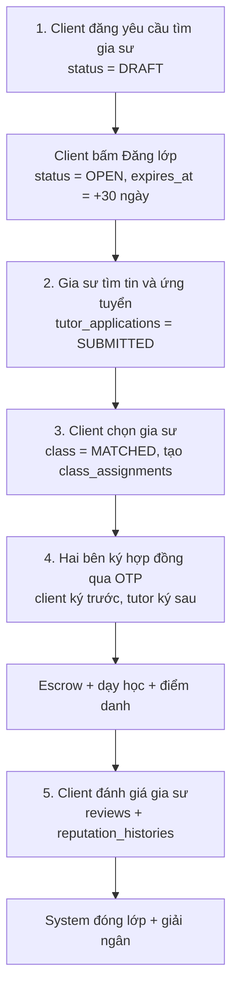

# TCS Code Flow — Luồng Private (Client ↔ Gia sư trực tiếp)

Bổ sung cho `TCS_personal_report_code_flow_guide.md` (file đó mô tả **luồng trung tâm**
BF-01 → BF-18). File này mô tả **luồng private**: client tự đăng tin, gia sư tự ứng tuyển,
không qua trung tâm.

Cách dùng khi quay video demo, giống file gốc:

1. Nói user story của bước.
2. Mở màn hình frontend.
3. Chỉ API frontend gọi.
4. Chỉ controller backend nhận request.
5. Chỉ service xử lý nghiệp vụ.
6. Chỉ repository/entity/table bị thay đổi.
7. Demo kết quả trên UI hoặc DB.

---

## 0. Tổng quan 5 bước



**Điểm khác biệt lớn nhất so với luồng trung tâm:** không có bảng `contracts` riêng cho
lớp private ở giai đoạn đầu — chữ ký lưu thẳng trên `class_assignments`
(`tutor_signed_at`, `client_signed_at`). Snapshot hợp đồng chỉ được sinh ra sau khi
**cả hai** đã ký (`ensurePrivateContractSnapshot`).

---

# BƯỚC 1 — Client Đăng Yêu Cầu Tìm Gia Sư

**Actor:** Client
**BF:** BF-05 — Class & Matching
**Màn hình:** `/dang-yeu-cau-tim-gia-su` → sau đó `/yeu-cau-tim-gia-su-cua-toi`

## Frontend

- Page: `frontend/src/features/home/pages/PostTutorRequestPage.tsx`
  - line 90: `handleSubmit(payload)` — chặn nếu không phải role CLIENT
- Form: `frontend/src/features/marketplace/components/ClassRequestForm.tsx` (1212 dòng)
  - line 268: `toggleSubject()` — đồng bộ 4 mảng state
  - line 363: `toggleWeekday()` — tự né khung giờ đã bị chiếm
  - line 487: `slotErrors` · line 516: `conflicts` · line 533: `missing`
  - line 555: `handleSubmit()` — 3 tầng kiểm tra
- Mapper: `frontend/src/features/marketplace/mappers/marketplaceMapper.tsx`
  - line 298: `formToPayload()` — nén cả form vào `detailsJson`
  - line 230: `totalBudget()`
- Hook: `frontend/src/features/home/hooks/useTutorRequestForm.tsx`
- API wrapper: `frontend/src/features/marketplace/api/marketplaceApi.tsx`
- Các API thật:
  - `GET /api/catalog/subjects` · `/grades` · `/provinces` (nạp danh mục)
  - `POST /api/marketplace/classes` (tạo tin, ra DRAFT)
  - `POST /api/marketplace/classes/{classId}/publish` (công khai, ra OPEN)

## Backend

- Controller: `backend/src/main/java/com/tcs/module/marketplace/controller/MarketplaceController.java`
  - line 71: `createClass(...)`
  - line 113: `publishClass(...)`
- Controller: `backend/src/main/java/com/tcs/module/catalog/controller/CatalogController.java`
  - line 33/38/43: `getSubjects()` · `getGrades()` · `getProvinces()`
- Service: `backend/src/main/java/com/tcs/module/marketplace/service/impl/MarketplaceServiceImpl.java`
  - line 349: `createClass(...)` — 4 chốt chặn
  - line 392: `applyRequest(...)` — DTO → Entity
  - line 420: `autoTitle(...)` — tự sinh tiêu đề
  - line 459: `publishClass(...)` — set OPEN + `expires_at = now + 30 ngày`

## Entity / Repository / DB

- `tutoring_classes` (INSERT) — chi tiết form nằm trong cột `details_json`
- `audit_logs` (INSERT) — action `CREATE_CLASS`
- Đọc: `subjects` · `grades` · `provinces` · `users` · `clients` · `user_penalties`

## Cách chỉ code khi demo

1. Mở `ClassRequestForm.tsx:555`, nói: form chặn 3 loại lỗi trước khi gửi —
   thiếu trường, buổi học sai, trùng giờ.
2. Mở `marketplaceMapper.tsx:298`, chỉ dòng `detailsJson: JSON.stringify(form)` —
   giải thích vì sao chỉ 1 cột chứa được cả form.
3. Mở `MarketplaceController.java:71`, nói controller mỏng, chỉ chuyển tiếp.
4. Mở `MarketplaceServiceImpl.java:349`, trình bày 4 chốt:
   - `requireUser()` — phải đăng nhập;
   - `requireFeature("CLASS_POSTING")` — tài khoản bị phạt thì cấm đăng;
   - `requireClient()` — phải có hồ sơ trong bảng `clients`;
   - phải có `subjectId` hoặc `detailsJson`.
5. **Nhấn mạnh:** `setStatus(DRAFT)` là ép cứng — client gửi `"status":"OPEN"` cũng vô ích.
6. Mở DB, `SELECT * FROM tutoring_classes ORDER BY class_id DESC LIMIT 1`, chỉ
   `status = DRAFT` và `expires_at = NULL`.
7. Bấm "Đăng lớp" trên UI, chạy lại query, chỉ `status = OPEN` và `expires_at` đã có giá trị.

---

# BƯỚC 2 — Gia Sư Tìm Yêu Cầu Giảng Dạy Và Ứng Tuyển

**Actor:** Tutor
**BF:** BF-05
**Màn hình:** `/tim-yeu-cau-giang-day`

## Frontend

- Page: `frontend/src/features/home/pages/FindClassPage.tsx`
  - **Rẽ nhánh theo vai:** TUTOR / TUTOR_CENTER → `TutorFindClassPage`;
    vai khác → `OpenClassListPage`
- Component: `frontend/src/features/marketplace/components/TutorFindClass.tsx`
- Thanh tìm: `frontend/src/features/marketplace/hooks/useClassSearch.tsx` (782 dòng)
- **Thuật toán chấm điểm:** `frontend/src/features/marketplace/matching/tutorMatching.tsx` (606 dòng)
  - `scoreSubject` · `scoreGrade` · `scoreLocation` · `scoreSalary` · `scoreSchedule`
- Modal ứng tuyển: `frontend/src/features/marketplace/components/ApplyClassModal.tsx`
  - line 117: `marketplaceApi.applyToClass(...)`
- Các API thật:
  - `GET /api/marketplace/classes?status=OPEN`
  - `GET /api/marketplace/applications/mine` (đánh dấu "✓ Đã ứng tuyển")
  - `GET /api/profile/me` (hiện hồ sơ trong modal)
  - `POST /api/marketplace/classes/{classId}/apply`

## Backend

- Controller: `MarketplaceController.java`
  - line 44: `listClasses(status)`
  - line 150: `listMyAppliedClassIds()`
  - line 123: `applyToClass(classId, request)`
- Service: `MarketplaceServiceImpl.java`
  - line 497: `applyToClass(...)`

## Nghiệp vụ trong `applyToClass()` — 6 chốt chặn

```java
requireTutor();                                        // phải là gia sư
penaltyAccessService.requireFeature(..., "CLASS_APPLICATION");
if (verificationStatus != VERIFIED) throw ...;         // phải đã xác minh
requireActiveWallet(userId);                           // phải có ví hoạt động
if (class.getStatus() != OPEN) throw ...;              // lớp còn mở
if (!stillVisible(class)) throw ...;                   // tin chưa hết hạn
if (existing != null && status != REJECTED) throw ...; // mỗi lớp 1 đơn
scheduleConflictOf(...)                                // không trùng lịch dạy sẵn có
```

## Entity / Repository / DB

- `tutor_applications` (INSERT) — `proposed_rates_json` lưu báo giá **từng môn**
- `audit_logs` (INSERT) — action `APPLY_CLASS`
- Notification gửi cho client: `notifyClientNewApplication(...)`

## Cách chỉ code khi demo

1. Mở `FindClassPage.tsx`, chỉ đoạn rẽ nhánh `isTutor ? <TutorFindClassPage/> : ...`
2. **Điểm nhấn kỹ thuật:** mở `TutorFindClass.tsx`, chỉ dòng
   `searchClasses(classes, criteria)` — nói rõ **backend không chấm điểm gì cả**,
   toàn bộ việc xếp hạng chạy trong trình duyệt tại `tutorMatching.tsx`.
   Sửa công thức không cần restart backend.
3. Mở `tutorMatching.tsx`, chỉ 5 hàm `score*` và cách 5 thanh trượt đổi trọng số.
4. Bấm "Ứng tuyển" → mở `ApplyClassModal.tsx`, chỉ chỗ nhập báo giá từng môn.
5. Mở `MarketplaceServiceImpl.java:497`, đọc 6 chốt chặn ở trên.
6. DB: `SELECT * FROM tutor_applications WHERE class_id = ?` — chỉ `status = SUBMITTED`
   và cột `proposed_rates_json`.

---

# BƯỚC 3 — Client Chọn Gia Sư Cho Tin Của Mình

**Actor:** Client
**BF:** BF-05
**Màn hình:** `/yeu-cau-tim-gia-su-cua-toi` → bấm "Xem chi tiết & gia sư ứng tuyển"

## Frontend

- Page: `frontend/src/features/marketplace/pages/MarketplacePage.tsx`
- Panel ứng viên: `frontend/src/features/marketplace/components/ApplicantsPanel.tsx`
  - line 68: `marketplaceApi.chooseApplicant(classId, applicationId)`
  - line 168: hộp xác nhận — "Các ứng viên còn lại sẽ bị từ chối"
  - line 266: hiển thị `điểm AI` với 3 mức màu (≥75 cao, ≥45 trung bình)
- Các API thật:
  - `GET /api/marketplace/classes/{classId}/applications`
  - `POST /api/marketplace/classes/{classId}/applications/{applicationId}/choose`
  - `POST /api/marketplace/classes/{classId}/applications/{applicationId}/reject`

## Backend

- Controller: `MarketplaceController.java`
  - line 155: `listApplicants(classId)`
  - line 160: `chooseApplicant(classId, applicationId)`
  - line 167: `rejectApplicant(...)`
- Service: `MarketplaceServiceImpl.java`
  - line 694: `listApplicants(...)` — chấm điểm AI + xếp hạng + gắn ⭐ Top 5
  - line 730: `chooseApplicant(...)`
  - `aiMatchScore(...)` — công thức 3 tiêu chí chia đều

## Điểm AI — 3 tiêu chí, mỗi tiêu chí 1/3

| Tiêu chí | Cách tính | Trọn phần khi |
|---|---|---|
| Đánh giá | `sao / 5` | 5 sao (2,5 sao → 50%) |
| Kinh nghiệm | `min(năm, 5) / 5` | ≥ 5 năm |
| Mức phí | `clamp(2 − báo_giá/giá_lớp, 0, 1)` | báo giá ≤ giá lớp; 2× giá lớp → 0 |

Sắp xếp: **điểm giảm dần → `appliedAt` tăng dần → `applicationId` tăng dần**
(bằng điểm thì ai nộp sớm hơn đứng trên).

## Nghiệp vụ trong `chooseApplicant()`

```java
requireOwnedClass(classId);                     // phải là chủ tin
if (cccdNumberOf(creator) rỗng) throw ...;      // client phải có CCCD mới lập được hợp đồng
if (class.getStatus() != OPEN) throw ...;
// Đơn được chọn -> ACCEPTED, tất cả đơn còn lại -> REJECTED
scheduleConflictOf(...)                          // chặn trùng lịch NGAY TẠI ĐÂY,
                                                 // trước khi có tiền escrow
applyTutorRatesToClass(...)                      // ghi đè học phí lớp theo báo giá tutor
class.setStatus(MATCHED);
ClassAssignment assignment = new ClassAssignment();
assignment.setStatus(PENDING);
notifyTutorInvited(...)
```

## Entity / Repository / DB

- `tutor_applications` (UPDATE) — 1 dòng `ACCEPTED`, còn lại `REJECTED`, set `reviewed_at`
- `tutoring_classes` (UPDATE) — `status = MATCHED`, `tuition_fee` + `details_json`
  cập nhật theo báo giá gia sư
- `class_assignments` (INSERT) — `status = PENDING`
- `notifications` (INSERT)

## Cách chỉ code khi demo

1. Mở `ApplicantsPanel.tsx`, chỉ khối `apm-ai` — dòng giải thích 3 tiêu chí cho người dùng.
2. Mở `MarketplaceServiceImpl.aiMatchScore(...)`, đọc công thức, đối chiếu điểm hiện trên UI.
3. Mở `chooseApplicant()` line 730, nhấn mạnh **2 điểm thiết kế**:
   - kiểm CCCD trước khi cho chọn — vì bước sau phải lập hợp đồng có pháp lý;
   - kiểm trùng lịch **tại đây** chứ không để xuống bước nạp escrow, vì lỗi sau khi
     đã chuyển tiền sẽ làm hỏng cả giao dịch.
4. DB: chạy 3 query cạnh nhau — `tutor_applications`, `tutoring_classes`,
   `class_assignments` — cho thấy 1 lần bấm nút đổi cả 3 bảng trong 1 transaction.

---

# BƯỚC 4 — Hai Bên Ký Hợp Đồng Qua OTP

**Actor:** Client ký trước → Tutor ký sau
**BF:** BF-06 — Contract & E-signature
**Màn hình:** `/lich-ca-nhan/ki-hop-dong`

## Frontend

- Page: `frontend/src/features/teaching/pages/ContractSigningPage.tsx`
  - line 262: `getAssignmentContract(assignmentId)` — nạp bản hợp đồng
  - line 361: `saveContractTerms(...)` — lưu điều khoản Bên B
  - line 379: `requestSignOtp(...)` — gửi OTP về email
  - line 401: `signAssignmentContract(assignmentId, otp)` — ký
- API wrapper: `frontend/src/features/teaching/api/teachingApi.tsx`
- Các API thật:
  - `GET  /api/marketplace/assignments/mine`
  - `GET  /api/marketplace/assignments/{assignmentId}/contract`
  - `POST /api/marketplace/assignments/{assignmentId}/contract-terms`
  - `POST /api/marketplace/assignments/{assignmentId}/sign/request-otp`
  - `POST /api/marketplace/assignments/{assignmentId}/sign`

## Backend

- Controller: `MarketplaceController.java`
  - line 194: `getAssignmentContract(...)`
  - line 199: `requestSignOtp(...)`
  - line 205: `signAssignmentContract(...)`
  - line 214: `saveContractTerms(...)`
- Service: `MarketplaceServiceImpl.java`
  - line 1156: `saveContractTermsB(...)`
  - line 1204: `requestSignOtp(...)`
  - line 1280: `signAssignmentContract(...)`

## Quy tắc nghiệp vụ quan trọng

**a) Bắt buộc đúng thứ tự — Bên A ký trước:**

```java
if ("TUTOR".equals(role) && assignment.getClientSignedAt() == null) {
    throw new IllegalArgumentException(
        "Bên A (phụ huynh/học sinh) phải ký hợp đồng trước. Vui lòng chờ Bên A ký.");
}
```

**b) Hai bên đều phải có CCCD** — kiểm ở cả `requestSignOtp` lẫn `signAssignmentContract`.

**c) Chống dò OTP:**

```java
SIGN_OTP_MAX_ATTEMPTS   // sai quá số lần
SIGN_OTP_LOCK_MINUTES   // bị khóa, phải đợi mới gửi lại được
```

**d) Khi và chỉ khi cả hai đã ký:**

```java
if (tutorSignedAt != null && clientSignedAt != null) {
    assignment.setPaymentMethod(resolvePrivatePaymentMethod(c));
    ensurePrivateContractSnapshot(assignment, c);   // ← lúc này mới tạo bản hợp đồng
    ensurePrivateEscrowPayment(assignment, c);      // ← sinh QR thanh toán escrow
    notifyClientContractPaymentReady(c);
}
```

## Entity / Repository / DB

- `class_assignments` (UPDATE) — `client_signed_at` · `tutor_signed_at` · `payment_method`
- `email_otps` (INSERT/UPDATE) — `purpose = CONTRACT_SIGNING`
- `contracts` + `contract_signatures` (INSERT) — chỉ sinh ra sau khi **cả hai** ký
- `escrow_transactions` (INSERT) — `ensurePrivateEscrowPayment`
- `notifications` (INSERT)

## Cách chỉ code khi demo

1. Đăng nhập client, mở `/lich-ca-nhan/ki-hop-dong`, bấm gửi OTP → mở hộp thư nhận mã.
2. Mở `MarketplaceServiceImpl.java:1204`, chỉ đoạn chặn "Bên A phải ký trước" —
   giải thích vì sao: hợp đồng do bên thuê đưa ra trước, gia sư ký chấp thuận sau.
3. Mở `signAssignmentContract()` line 1280, chỉ nhánh `if (tutorSignedAt != null &&
   clientSignedAt != null)` — nói rõ **snapshot hợp đồng và escrow chỉ sinh ở đây**,
   không sinh sớm hơn.
4. DB: `SELECT client_signed_at, tutor_signed_at FROM class_assignments WHERE assignment_id = ?`
   — chạy sau mỗi lần ký để thấy 2 cột lần lượt có giá trị.
5. Sau lần ký thứ 2, chạy `SELECT * FROM contracts` và `SELECT * FROM escrow_transactions`
   — cho thấy 2 bảng vừa xuất hiện dòng mới.

---

# BƯỚC 5 — Client Đánh Giá Gia Sư

**Actor:** Client
**BF:** BF-08 — Review & Reputation (UC-65, UC-66)
**Màn hình:** `/nhan-xet-gia-su`

## Frontend

- Page: `frontend/src/features/reviews/pages/MyReviewsPage.tsx`
- API wrapper: `frontend/src/features/reviews/api/reviewApi.tsx`
  - line 13: `getReviewable()`
  - line 17: `create(payload)`
  - line 20: `update(reviewId, payload)`
  - line 22: `getTutorReputation(tutorId)`
- Trang hồ sơ công khai: `/gia-su/:tutorId` — hiển thị tổng quan sao + list review
- Các API thật:
  - `GET  /api/contract/reviews/reviewable`
  - `POST /api/contract/reviews`
  - `PUT  /api/contract/reviews/{reviewId}`
  - `GET  /api/contract/reviews/reputation/{tutorId}`

## Backend

- Controller: `backend/src/main/java/com/tcs/module/contract/controller/ContractController.java`
  - line 36: `createReview(...)`
  - line 128: `updateReview(...)`
  - line 131: `getTutorReputation(...)`
  - line 141: `getMyReviewableAssignments()`
- Service: `backend/src/main/java/com/tcs/module/contract/service/impl/ContractServiceImpl.java`
  - line 1989: `createReview(...)`
  - line 2124: `getTutorReputation(...)`
  - line 2257: `getMyReviewableAssignments()`

## Nghiệp vụ trong `createReview()`

```java
Long clientId = authHelper.requireRole(UserRole.CLIENT).getUserId();  // chỉ CLIENT
requireReviewerOfClass(tutoringClass, clientId);                      // phải là chủ lớp

List<LocalDate> occurred = occurredLessonDates(classId);
if (occurred.isEmpty())
    throw new BusinessException("Chưa có buổi học nào diễn ra để đánh giá");

// Số lượt đánh giá không được vượt số buổi đã học
long submitted = reviewRepository.findByReviewer_UserId(clientId).stream()
        .filter(r -> r.getReviewType() == CLIENT_TO_TUTOR)
        .filter(r -> r.getAssignment().getAssignmentId().equals(assignmentId))
        .count();
if (submitted >= occurred.size())
    throw new BusinessException("Bạn đã đánh giá đủ số lượt cho các buổi đã học");

if (rating < 1 || rating > 5) throw ...;

Review review = new Review();
review.setReviewType(CLIENT_TO_TUTOR);
review.setCriteriaJson(serializeCriteria(request.getCriteria()));   // điểm từng tiêu chí
review.setAnonymous(anonymous);
reviewRepository.save(review);

recomputeTutorReputation(tutor, tutorUserId);                        // tính lại rating_avg
eventPublisher.publishEvent(new ClientReviewedClassEvent(classId));  // ← Spring event
```

**Điểm thiết kế đáng nói nhất:** dòng cuối phát **Spring event**, không gọi thẳng
marketplace. `MarketplaceServiceImpl` lắng nghe event này; nếu gia sư đã bấm "hoàn thành"
trước đó thì lớp **tự đóng và tự giải ngân escrow**. Nhờ event mà module `contract`
không phải phụ thuộc ngược vào module `marketplace`.

## Entity / Repository / DB

- `reviews` (INSERT) — `criteria_json` lưu điểm từng tiêu chí, cờ `anonymous`
- `tutors` (UPDATE) — `rating_avg` tính lại
- `reputation_histories` (INSERT) — lưu vết thay đổi danh tiếng
- Sau event: `tutoring_classes` → `COMPLETED`, `escrow_transactions` → giải ngân,
  `wallets` gia sư được cộng tiền

## Cách chỉ code khi demo

1. Mở `/nhan-xet-gia-su`, chỉ danh sách lớp đủ điều kiện đánh giá
   (`GET /reviews/reviewable`).
2. Mở `ContractServiceImpl.java:1989`, đọc 4 điều kiện: đúng vai CLIENT, đúng chủ lớp,
   đã có buổi diễn ra, chưa vượt số lượt.
3. **Nhấn mạnh luật số lượt**: mỗi buổi đã học cho phép 1 lượt đánh giá — không cho
   spam đánh giá một gia sư.
4. Chỉ dòng `eventPublisher.publishEvent(new ClientReviewedClassEvent(...))` —
   giải thích cơ chế event giúp 2 module không phụ thuộc vòng tròn.
5. Gửi đánh giá → mở `/gia-su/{tutorId}` cho thấy sao đã cập nhật.
6. DB: `SELECT rating_avg FROM tutors WHERE tutor_id = ?` trước và sau khi đánh giá.

---

# Bảng tổng hợp nhanh — đưa vào slide

| Bước | Actor | Màn hình | API chính | Service | Bảng thay đổi |
|---|---|---|---|---|---|
| 1 | Client | `/dang-yeu-cau-tim-gia-su` | `POST /marketplace/classes`<br>`POST /marketplace/classes/{id}/publish` | `MarketplaceServiceImpl:349`<br>`:459` | `tutoring_classes`, `audit_logs` |
| 2 | Tutor | `/tim-yeu-cau-giang-day` | `GET /marketplace/classes?status=OPEN`<br>`POST /marketplace/classes/{id}/apply` | `:497` | `tutor_applications`, `notifications` |
| 3 | Client | `/yeu-cau-tim-gia-su-cua-toi` | `GET .../applications`<br>`POST .../applications/{id}/choose` | `:694`, `:730` | `tutor_applications`, `tutoring_classes`, `class_assignments` |
| 4 | Client → Tutor | `/lich-ca-nhan/ki-hop-dong` | `POST .../sign/request-otp`<br>`POST .../sign` | `:1204`, `:1280` | `class_assignments`, `email_otps`, `contracts`, `escrow_transactions` |
| 5 | Client | `/nhan-xet-gia-su` | `POST /contract/reviews` | `ContractServiceImpl:1989` | `reviews`, `tutors`, `reputation_histories` |

---

# Script nói khi demo — bản rút gọn 5 phút

> "Luồng private cho phép phụ huynh tự tìm gia sư, không qua trung tâm. Có 5 bước.
>
> **Một** — phụ huynh đăng tin. Form ở `ClassRequestForm`, kiểm tra 3 loại lỗi ngay
> trên trình duyệt rồi mới gửi. Backend ở `MarketplaceServiceImpl.createClass` có 4
> chốt chặn, và luôn lưu ở trạng thái nháp — muốn công khai phải bấm Đăng lớp riêng,
> lúc đó mới đặt hạn hiển thị 30 ngày.
>
> **Hai** — gia sư tìm tin. Điểm đáng chú ý là **backend không chấm điểm gì cả**, nó
> chỉ trả danh sách lớp thô; toàn bộ việc tính độ phù hợp chạy trong trình duyệt ở
> `tutorMatching.tsx`. Khi ứng tuyển thì backend kiểm 6 chốt: đã xác minh chưa, có ví
> chưa, tin còn hạn không, đã nộp đơn chưa, có trùng lịch dạy sẵn có không.
>
> **Ba** — phụ huynh chọn gia sư. Hệ thống chấm điểm AI theo 3 tiêu chí chia đều: đánh
> giá, kinh nghiệm, mức phí. Khi bấm chọn, một transaction đổi cả 3 bảng: đơn được chọn
> thành ACCEPTED và tất cả đơn khác thành REJECTED, lớp chuyển MATCHED, và sinh một
> `class_assignment`.
>
> **Bốn** — ký hợp đồng bằng OTP email. Bắt buộc Bên A ký trước rồi Bên B mới ký được.
> Khi và chỉ khi cả hai đã ký, hệ thống mới sinh bản hợp đồng và mã QR nạp tiền escrow.
>
> **Năm** — sau khi học, phụ huynh đánh giá. Mỗi buổi đã học được một lượt đánh giá.
> Đánh giá xong phát một Spring event, marketplace nghe được sẽ tự đóng lớp và giải
> ngân tiền cho gia sư."
