# TCS Deployment Architecture Diagram

```mermaid
flowchart TB
    %% ==========================================
    %% CLIENT LAYER
    %% ==========================================
    subgraph ClientTier["CLIENT TIER (User Devices)"]
        UserBrowser["Web Browser (Desktop / Mobile)<br/>• React 19 SPA Client<br/>• Axios HTTP Client<br/>• StompJS WebSocket Client"]
    end

    %% ==========================================
    %% PRODUCTION HOST / DOCKER COMPOSE
    %% ==========================================
    subgraph HostServer["PRODUCTION HOST (Linux VPS / Docker Host)"]
        subgraph DockerNetwork["Docker Compose Default Network (auto-generated)"]
            
            %% Nginx Reverse Proxy Container
            subgraph ContainerNginx["Container: frontend (nginx:alpine)"]
                NginxServer["Nginx Reverse Proxy<br/>• Port: 80 (HTTP only)<br/>• SSL/TLS: External LB/Cloudflare<br/>• Gzip & WebSocket Upgrade Proxy<br/>• SPA Fallback (try_files)"]
                StaticFiles["Static SPA Bundle<br/>(HTML, CSS, TSX/JS Bundles)<br/>from /usr/share/nginx/html"]
            end

            %% Spring Boot Backend Container
            subgraph ContainerBackend["Container: backend (eclipse-temurin:21-jre-alpine)"]
                SpringBootApp["TCS Core Backend Service<br/>• Embedded Tomcat (Port: 8080)<br/>• Spring Security & JWT Filter<br/>• REST Controllers & STOMP Broker<br/>• RAG Engine & Multi-provider AI Router<br/>• Spring @Scheduled Background Jobs<br/>• TZ: Asia/Ho_Chi_Minh"]
                ZXingReader["ZXing QR & TwelveMonkeys ImageIO<br/>(CCCD eKYC Parser + WebP/JPEG)"]
                FileServing["Spring Static Resource Handler<br/>(Authorization + File Serving)"]
            end

            %% MySQL Database Container
            subgraph ContainerMySQL["Container: mysql (mysql:8.0)"]
                MySQLDB["MySQL Database (Port: 3306)<br/>• Charset: utf8mb4 / InnoDB<br/>• Flyway Migrations (V1..V34)<br/>• ai_knowledge_chunks (Vector Store)<br/>• Users, Classes, Escrows, Contracts<br/>• TZ: Asia/Ho_Chi_Minh<br/>• Healthcheck: mysqladmin ping"]
            end

        end

        %% Persistent Storage Volumes
        subgraph Volumes["Host Persistent Storage (Docker Volumes)"]
            DBVolume[("mysql_data Volume<br/>/var/lib/mysql")]
            UploadVolume[("uploads_data Volume<br/>/app/uploads<br/>(public & private files)")]
        end
    end

    %% ==========================================
    %% THIRD-PARTY / EXTERNAL SERVICES
    %% ==========================================
    subgraph ExternalServices["EXTERNAL SERVICES & CLOUD APIs"]
        GoogleAuth["Google Identity Services<br/>(OAuth 2.0 / OIDC Login)<br/>Client ID: 220681798961-..."]
        SePayGate["SePay Payment Gateway<br/>(VietQR & Webhook Engine)"]
        SMTPServer["Google SMTP Mail Server<br/>(smtp.gmail.com:587 STARTTLS)<br/>OTP & Email Notifications"]
        
        subgraph AiProviders["Multi-Provider LLM & Vector Cloud"]
            GeminiAI["Google Gemini AI Studio<br/>• gemini-embedding-001 (768d)<br/>• gemini-2.0-flash (Chat)"]
            GroqAI["Groq Cloud<br/>(llama-3.3-70b-versatile)"]
            CerebrasAI["Cerebras AI<br/>(llama-3.3-70b Ultra-fast)"]
            DeepSeekAI["DeepSeek AI<br/>(deepseek-chat)"]
        end
    end

    %% ==========================================
    %% RELATIONSHIPS & DATA FLOW
    %% ==========================================
    
    %% Client to Nginx
    UserBrowser -->|"HTTP (Port 80 → 80)<br/>WSS Upgrade (/ws)"| NginxServer
    NginxServer -.->|"Serve Static SPA<br/>(location / fallback)"| StaticFiles

    %% Nginx to Backend (All Dynamic Routes)
    NginxServer -->|"Proxy /api/**<br/>(HTTP backend:8080)"| SpringBootApp
    NginxServer -->|"Proxy /uploads/**<br/>(Auth + File Serving)"| FileServing
    NginxServer -->|"Proxy /ws (WebSocket)<br/>(Upgrade: websocket)"| SpringBootApp

    %% Backend to Database & Storage
    SpringBootApp -->|"JDBC / HikariCP<br/>(mysql:3306)"| MySQLDB
    SpringBootApp -->|"Read/Write Files<br/>(Authorization Check)"| UploadVolume
    SpringBootApp --- ZXingReader
    FileServing --- UploadVolume
    MySQLDB --- DBVolume

    %% Backend to External APIs
    SpringBootApp -->|"REST / HTTPS<br/>(Verify ID Token)"| GoogleAuth
    SpringBootApp -->|"REST / HTTPS<br/>(Generate Embeddings & Chat)"| GeminiAI
    SpringBootApp -->|"REST / Fallback Router<br/>(Provider Order: groq → cerebras → deepseek → gemini)"| GroqAI
    SpringBootApp -->|"REST / High-speed Chat"| CerebrasAI
    SpringBootApp -->|"REST / Fallback Chat"| DeepSeekAI
    SpringBootApp -->|"SMTP / TLS (Port 587)<br/>(OTP & Notifications)"| SMTPServer
    
    %% Webhook from SePay to Backend via Nginx
    SePayGate -->|"POST /api/finance/webhooks/sepay<br/>(Inbound Webhook via Nginx)"| NginxServer

    %% ==========================================
    %% PORT MAPPING ANNOTATIONS
    %% ==========================================
    HostServer -.->|"Host:33060 → mysql:3306"| MySQLDB
    HostServer -.->|"Host:80 → frontend:80"| NginxServer
    HostServer -.->|"Host:8081 → backend:8080"| SpringBootApp

    %% ==========================================
    %% STYLING
    %% ==========================================
    classDef client fill:#e0f2fe,stroke:#0284c7,stroke-width:2px,color:#0369a1;
    classDef nginx fill:#fef3c7,stroke:#d97706,stroke-width:2px,color:#92400e;
    classDef backend fill:#dcfce7,stroke:#16a34a,stroke-width:2px,color:#166534;
    classDef db fill:#f3e8ff,stroke:#9333ea,stroke-width:2px,color:#6b21a8;
    classDef external fill:#fee2e2,stroke:#dc2626,stroke-width:2px,color:#991b1b;
    classDef volume fill:#f1f5f9,stroke:#475569,stroke-width:1px,stroke-dasharray: 5 5,color:#334155;

    class UserBrowser client;
    class NginxServer,StaticFiles nginx;
    class SpringBootApp,ZXingReader,FileServing backend;
    class MySQLDB db;
    class GoogleAuth,SePayGate,SMTPServer,GeminiAI,GroqAI,CerebrasAI,DeepSeekAI external;
    class DBVolume,UploadVolume volume;
```

## Key Architecture Points

### Container Configuration
- **frontend**: Nginx Alpine serving React 19 SPA build + reverse proxy
- **backend**: Eclipse Temurin 21 JRE Alpine running Spring Boot 4.0.6
- **mysql**: MySQL 8.0 with utf8mb4 charset and healthcheck

### Port Mapping (Host → Container)
- `80:80` - Nginx (HTTP only, SSL via external LB/Cloudflare)
- `8081:8080` - Backend (direct access for debugging)
- `33060:3306` - MySQL (non-standard port to avoid local MySQL conflict)

### Network & Volumes
- **Network**: Docker Compose auto-generated default network
- **Volumes**: 
  - `mysql_data` → `/var/lib/mysql`
  - `uploads_data` → `/app/uploads`

### AI Provider Routing
Backend uses configurable provider order (default: groq → cerebras → deepseek → gemini) with automatic fallback on failure.

### File Upload Security
All `/uploads/**` requests go through backend authorization before serving files - Nginx does NOT serve uploads directly.

### Timezone
Both backend and MySQL containers use `TZ=Asia/Ho_Chi_Minh` for consistent timestamp handling.

### CORS Configuration
Backend allows multiple origins including:
- tutorconnectsystem.io.vn (with/without www, HTTP/HTTPS)
- localhost:3000 / localhost:5173 (development)
- 180.93.34.24 (production IP)
